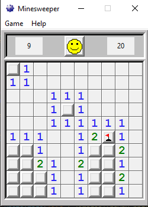

# Minesweeper

## How-to run:
1. Install Python 3 via Microsoft App Store
2. Open command prompt (cmd) in the folder location where minesweeper.py is.
3. Run `python3 minesweeper.py`

## Dependencies:
- `tkinter`

## Interface:
### The goal was to make a minesweeper application that looks very similar to the *original* minesweeper (Windows 2000), so most of the buttons work just like they should, except for the `Help` tab, which is there for look-alike purposes only.

## Example images:
### 10x10:

### 30x16:

