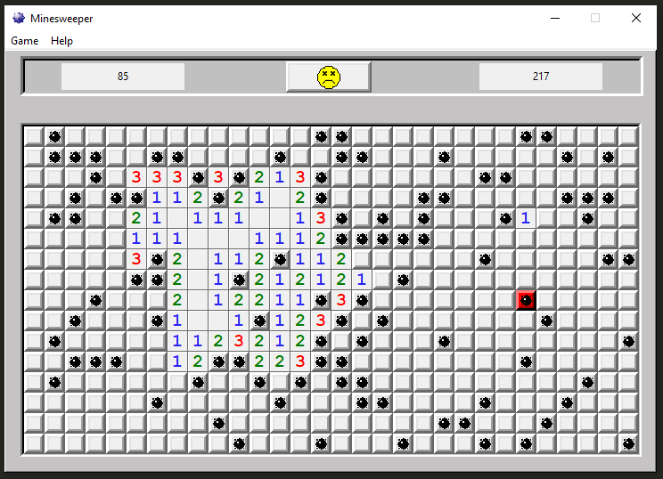

# Minesweeper

## Dependencies:
- 'tkinter'

## Interface:
### The goal was to make a minesweeper application that looks very similar to the *original* minesweeper (Windows 2000), so most of the buttons work just like they should, except for the `Help` tab, which is there for look-alike purposes only.

## Example Images:
### 10x10:

### 30x16:

